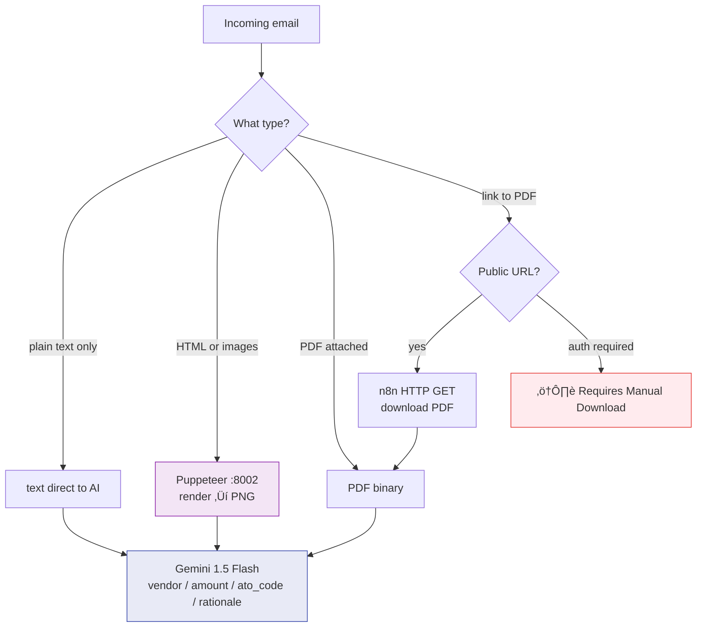

# 🏗️ Architecture

End-to-end design of the ATO tax automation pipeline across all milestones.  
All services self-hosted on **OCI Oracle Always Free ARM VM** (Ampere A1, 4 OCPU / 24GB RAM).

---

## M3 Processing Pipeline

```mermaid
flowchart TD
    A["Incoming email"] --> B{What type?}

    B -->|plain text only| C["text direct to AI"]
    B -->|HTML or images| D["Puppeteer :8002\nrender ‚Üí PNG"]
    B -->|PDF attached| E["PDF binary"]
    B -->|link to PDF| F{Public URL?}

    F -->|yes| G["n8n HTTP GET\ndownload PDF"] --> E
    F -->|auth required| H["⚠️ Requires Manual Download"]

    C --> I["Gemini 1.5 Flash\nvendor / amount / ato_code / rationale"]
    D --> I
    E --> I

    style D fill:#f3e5f5,stroke:#8e24aa
    style I fill:#e8eaf6,stroke:#3949ab
    style H fill:#ffebee,stroke:#e53935
```

---

## Google Sheets Schema

| Col | Field | Source | Example |
|-----|-------|--------|---------|
| A | Date Logged | Code Node | 2025-07-12 |
| B | Vendor | Vision AI | eBay / Biggins |
| C | Amount (AUD) | Vision AI | 28.00 |
| D | ATO Code | Vision AI | D5 / Item 21 |
| E | Probability | Vision AI | 90% |
| F | Status | Vision AI | Verified |
| G | AI Reason | Vision AI | NVMe SSD for homelab server |
| H | ATO Rationale | Vision AI (M3) | Deductible under TR 2023/1... |
| I | Source Subject | Code Node | Fwd: Order confirmed: WD SN740 |
| J | Depreciation Flag | Vision AI | FALSE |
| K | Financial Year | Code Node | FY2024-25 |

---

## Service Ports

| Service | Port | Purpose |
|---------|------|---------|
| n8n | 5678 | Workflow UI + orchestrator |
| pdf-service | 8001 | PyMuPDF text extraction (M2) |
| screenshotter | 8002 | Puppeteer HTML/PDF ‚Üí PNG (M3) |

---

## Why Vision Over HTML Parsing

| Approach | eBay rich HTML | Image amounts | Scanned PDF | Forwarded chain | Vendor changes template |
|----------|:-:|:-:|:-:|:-:|:-:|
| Regex / text strip | ‚ùå | ‚ùå | ‚ùå | ‚ùå | ‚ùå |
| PyMuPDF text extract | ‚úÖ (PDF only) | ‚ùå | ‚ùå | ‚ùå | ‚úÖ |
| Browser render ‚Üí Vision AI | ‚úÖ | ‚úÖ | ‚úÖ | ‚úÖ | ‚úÖ |
