# 🏗️ Architecture

End-to-end design of the ATO tax automation pipeline across all milestones.  
All services self-hosted on **OCI Oracle Always Free ARM VM** (Ampere A1, 4 OCPU / 24GB RAM).

---

## Current State — M1 + M2

```mermaid
flowchart TD
    A([📧 Gmail Inbox\nunread emails]) -->|poll every 60s| B[Gmail Trigger\nn8n]

    B --> C{Has PDF\nAttachment?}

    C -->|YES| D[pdf-service\nFastAPI :8001\nPyMuPDF]
    D -->|extracted text\n+ AUD amounts| E[Merge PDF + Email\nCode Node]

    C -->|NO| F[Email Only\nCode Node]

    E --> G[AI Triage\nOpenRouter\nArcee AI free]
    F --> G

    G -->|raw JSON string| H[Parse AI JSON\nCode Node]

    H --> I{potential_deduction\n== true?}

    I -->|NO| M
    I -->|YES| J[Google Sheets\nAppend Row]

    J --> K{status ==\nRequires Manual\nCheck?}

    K -->|YES| L[📧 Gmail Alert\ntaxdtran@gmail.com]
    K -->|NO| M

    L --> M[Mark Email\nas Read]

    style D fill:#e8f5e9,stroke:#43a047
    style G fill:#e3f2fd,stroke:#1e88e5
    style J fill:#fff3e0,stroke:#fb8c00
```



---

## Target State — M3 Vision Pipeline

> Replaces all HTML parsing and text extraction with a browser render → screenshot → vision model approach.  
> Format-agnostic: works on rich HTML emails, image-embedded amounts, scanned PDFs, forwarded chains.

```mermaid
flowchart TD
    A([📧 Gmail Inbox\nunread emails]) -->|poll every 60s| B[Gmail Trigger\nn8n]

    B --> C{Has PDF\nAttachment?}

    C -->|YES — PDF| D[screenshotter\nPuppeteer :8002\nrender PDF → PNG]
    C -->|YES — Image| D
    C -->|NO — HTML email| D2[screenshotter\nrender HTML → PNG]

    D --> E[Vision Model\nGemini 1.5 Flash\nor Claude Sonnet]
    D2 --> E

    E -->|structured JSON\nvendor, amount,\nato_code, rationale| F[Parse + Enrich\nCode Node\nadd FY, date, subject]

    F --> G{potential_deduction\n== true?}

    G -->|NO| K
    G -->|YES| H[Google Sheets\nAppend Row\nA–K columns]

    H --> I{depreciation\nrequired?}

    I -->|YES > $300| J[📧 Depreciation\nAlert Email]
    I -->|NO| L{Requires\nManual Check?}

    J --> L

    L -->|YES| M[📧 Manual Check\nAlert Email]
    L -->|NO silent| K

    M --> K[Mark Email\nas Read]

    style D fill:#f3e5f5,stroke:#8e24aa
    style D2 fill:#f3e5f5,stroke:#8e24aa
    style E fill:#e8eaf6,stroke:#3949ab
    style H fill:#fff3e0,stroke:#fb8c00
```



---

## Infrastructure — OCI ARM VM

```mermaid
flowchart LR
    subgraph internet["🌐 Internet"]
        GM([Gmail API])
        OR([OpenRouter\nArcee AI])
        GV([Gemini Flash\nVision API])
        GS([Google Sheets\nAPI])
    end

    subgraph oci["☁️ OCI Always Free ARM VM\nUbuntu 22.04 — 4 OCPU / 24GB"]
        subgraph docker["🐳 Docker Compose"]
            N8N[n8n\n:5678]
            PDF[pdf-service\nFastAPI + PyMuPDF\n:8001]
            SC[screenshotter\nPuppeteer + Chromium\n:8002]
        end
        ENV[.env\nsecrets]
    end

    subgraph you["👤 You"]
        BR([Browser\nn8n UI])
        TAX([taxdtran\n@gmail.com])
    end

    GM <-->|OAuth2| N8N
    N8N <-->|HTTP| OR
    N8N <-->|HTTP| GV
    N8N <-->|OAuth2| GS
    N8N -->|localhost| PDF
    N8N -->|localhost| SC
    BR -->|:5678| N8N
    N8N -->|SMTP| TAX
    ENV -.->|injected| docker
```

---

## Data Flow — Per Email


---

## Google Sheets Schema

| Col | Field | Source | Example |
|-----|-------|--------|---------|
| A | Date Logged | Code Node | 2025-07-12 |
| B | Vendor | Vision AI | eBay / Biggins |
| C | Amount (AUD) | Vision AI | 28.00 |
| D | ATO Code | Vision AI | D5 / Item 21 |
| E | Probability | Vision AI | 90% |
| F | Status | Vision AI | Verified |
| G | AI Reason | Vision AI | NVMe SSD for homelab server |
| H | ATO Rationale | Vision AI (M3) | Deductible under TR 2023/1... |
| I | Source Subject | Code Node | Fwd: Order confirmed: WD SN740 |
| J | Depreciation Flag | Vision AI | FALSE |
| K | Financial Year | Code Node | FY2024-25 |

---

## Service Ports

| Service | Port | Purpose |
|---------|------|---------|
| n8n | 5678 | Workflow UI + orchestrator |
| pdf-service | 8001 | PyMuPDF text extraction (M2) |
| screenshotter | 8002 | Puppeteer HTML/PDF → PNG (M3) |

---

## Why Vision Over HTML Parsing

| Approach | eBay rich HTML | Image amounts | Scanned PDF | Forwarded chain | Vendor changes template |
|----------|:-:|:-:|:-:|:-:|:-:|
| Regex / text strip | ❌ | ❌ | ❌ | ❌ | ❌ |
| PyMuPDF text extract | ✅ (PDF only) | ❌ | ❌ | ❌ | ✅ |
| Browser render → Vision AI | ✅ | ✅ | ✅ | ✅ | ✅ |
